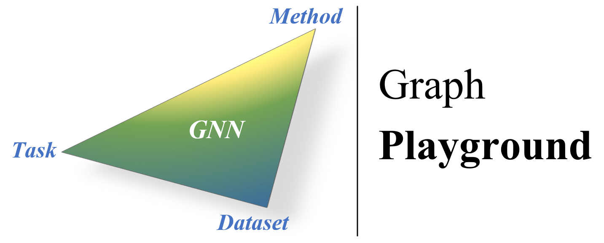

# Graph Playground (_v-0.1_)

Graph Playground is a highy emsamble project for Graph Neural Network (_GNN_), using pytorch framwork and other supporting packages (DGL, Torch Geometric, Ray, etc).
The goal of this project is to build a framework that is easy to get started with, highly integrated, and unified.

**Currently in the process of updating...Not enough tasks, datasets and methods are supported, pls be patient.**
# Main Install:
- python 3.9  
- pytorch 1.10.0_cuda11.3
- torch_geometric
- dgl
- ray
- ogb
- termcolor
- munkres
- gym
- setproctitle
- matplotlib
- timm
- psycopg2-binary
Full installed packages, pls see requirements (not all of them are needed)

# Quickly Use:
Set your choose in main.py Line. 148:

Task (e.g.,  `task = 'Semi'    # choice: Semi Unsup Sup Rein Noise Fed`)

Method (e.g., `method = 'Gcn'  # choice: Gcn Gat Sage DGI...`)

Dataset (e.g., `dataset = 'Cora' # choice: Cora CiteSeer PubMed freebase Photo Computers...`)

And Run:

`python main.py`

# Task:
updating

# Method:
updating

# Dataset:
updating

# Params and Auto-turning:
updating

# Log your results to Database:
updating

# Project structure:
updating

# Todo List:

- [ ] 添加supervised learning
- [x] 添加图像数据集
- [x] 支持torch_geometric
- [ ] models文件的结构还需要后续的调整
- [ ] Net.py 后续会分成2个文件 Layer.py and Basic_model.py
- [x] 添加E2CGRL, SUGRL, DGI

